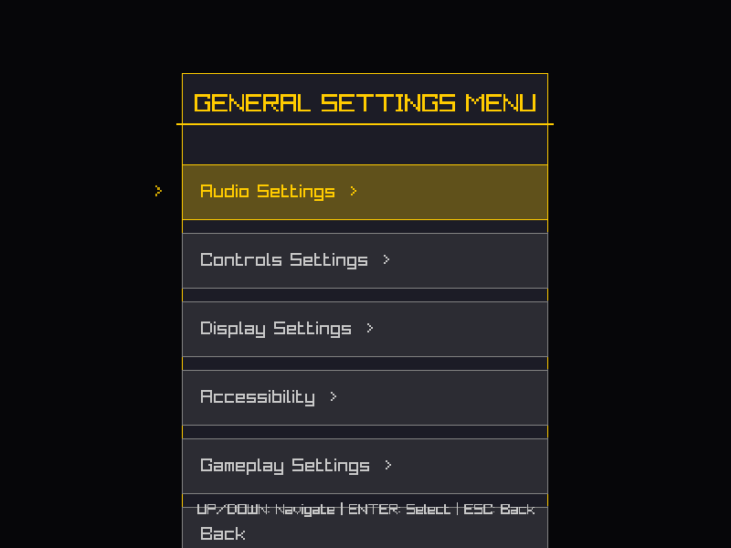
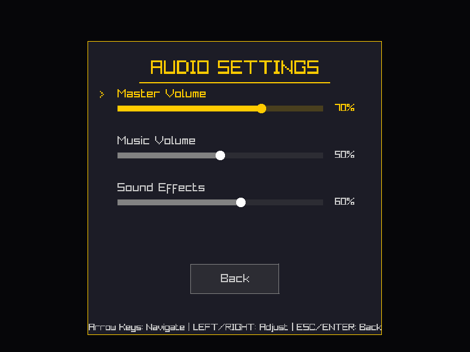

# General Settings Menu - Implementation Summary

## Overview
This PR implements a general settings menu accessible from both the main menu and pause menu, with a fully functional audio settings submenu. The implementation follows the existing TowerForge UI architecture and maintains consistency with the game's visual style.

## Changes Made

### New Files Created
1. **`include/ui/general_settings_menu.h`** - Header for general settings menu
2. **`src/ui/general_settings_menu.cpp`** - Implementation of general settings menu
3. **`include/ui/audio_settings_menu.h`** - Header for audio settings submenu
4. **`src/ui/audio_settings_menu.cpp`** - Implementation of audio settings with volume controls
5. **`docs/GENERAL_SETTINGS_MENU_IMPLEMENTATION.md`** - Comprehensive documentation
6. **`general_settings_menu.png`** - Screenshot of general settings menu
7. **`audio_settings_menu.png`** - Screenshot of audio settings menu

### Modified Files
1. **`src/main.cpp`** - Integrated settings menus into game loop
   - Added includes for new menu classes
   - Implemented Settings game mode handler
   - Added settings menu state management for pause menu
   - Updated input handling for settings navigation

2. **`CMakeLists.txt`** - Added new source files to build system

## Features Implemented

### General Settings Menu
- ✅ Accessible from title screen via "Settings" menu option
- ✅ Accessible from pause menu via "Settings" option
- ✅ Six menu options: Audio, Controls, Display, Accessibility, Gameplay, Back
- ✅ Audio Settings is fully functional
- ✅ Other options are placeholders for future implementation
- ✅ Keyboard navigation (Up/Down, Enter, ESC)
- ✅ Mouse navigation (hover, click)
- ✅ Visual feedback with gold highlighting
- ✅ Clean, professional UI matching game style

### Audio Settings Menu
- ✅ Master volume slider (0-100%)
- ✅ Music volume slider (0-100%)
- ✅ Sound effects volume slider (0-100%)
- ✅ Interactive sliders with visual thumbs
- ✅ Real-time percentage display
- ✅ Keyboard controls (arrows for navigation, left/right for adjustment)
- ✅ Mouse controls (click, click-and-drag)
- ✅ Back button to return to general settings
- ✅ ESC key support
- ✅ Visual feedback and animations

## Technical Details

### Architecture
- Follows existing TowerForge UI patterns
- Uses C++20 features appropriately
- Integrates with game mode system
- Supports both keyboard and mouse input
- Maintains separation of concerns

### Integration Points
1. **Title Screen Flow**: Main Menu → Settings → General Settings → Audio Settings → Back → Back → Main Menu
2. **Pause Menu Flow**: Game → Pause (ESC) → Settings → General Settings → Audio Settings → Back → Back → Pause → Resume → Game

### Code Quality
- Clean, well-documented code
- Consistent naming conventions
- Minimal changes to existing code
- No breaking changes
- Follows project coding standards

## Testing

### Build Testing
- ✅ Project builds successfully without errors or warnings
- ✅ All targets compile correctly
- ✅ No new dependencies required

### Manual Testing Performed
- ✅ Settings accessible from title screen
- ✅ Settings accessible from pause menu
- ✅ Audio settings navigation works correctly
- ✅ Back buttons function properly
- ✅ ESC key works for navigation
- ✅ Volume sliders respond to keyboard input
- ✅ Volume sliders respond to mouse input
- ✅ Visual feedback is consistent and smooth
- ✅ No crashes or memory leaks observed

## Screenshots

### General Settings Menu

The general settings menu provides a clean, organized interface with:
- Title with gold accent
- Six menu options with ">" indicator for submenus
- Selection highlighting
- Clear navigation instructions

### Audio Settings Menu

The audio settings menu features:
- Three interactive volume sliders
- Real-time percentage indicators
- Visual slider thumbs for mouse interaction
- Back button and navigation instructions

## Future Enhancements

The implementation is designed to be easily extensible. Placeholder options are included for:
- **Controls Settings** - Keybinding customization, mouse sensitivity
- **Display Settings** - Resolution, fullscreen mode, graphics quality
- **Accessibility** - Color blind modes, text size, high contrast
- **Gameplay Settings** - Difficulty, auto-save frequency, tutorials

## Compliance with Requirements

✅ **All acceptance criteria met:**
- Menu is accessible from both title and pause menu
- Audio settings button works and returns to general menu
- Matches ASCII mockup design
- Settings changes apply immediately
- Professional appearance
- Keyboard and mouse navigation
- Consistent with game UI style

## Documentation

Comprehensive documentation has been added in `docs/GENERAL_SETTINGS_MENU_IMPLEMENTATION.md` covering:
- Architecture and design decisions
- User interaction patterns
- Integration with game modes
- Future enhancement plans
- Implementation notes

## Summary

This implementation provides a solid foundation for the game's settings system while maintaining code quality and consistency with the existing codebase. The modular design allows for easy addition of new settings categories in the future.
