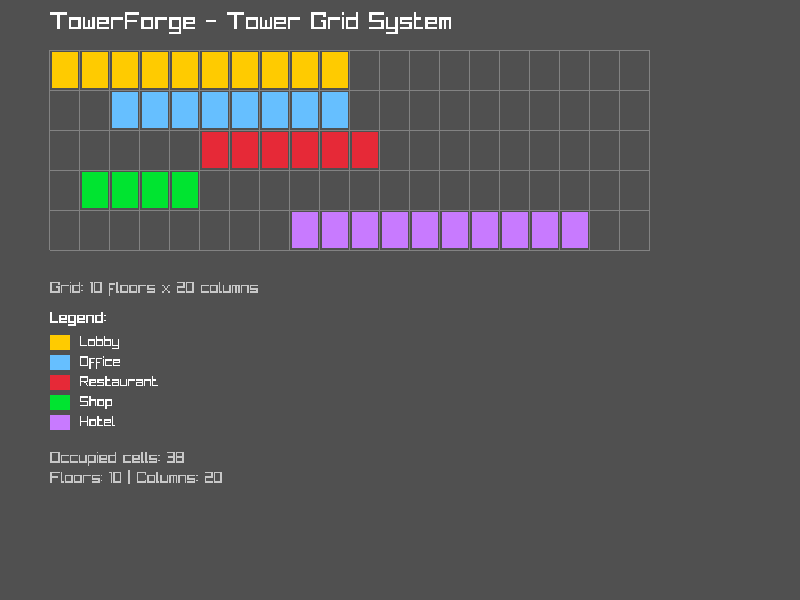

# TowerForge

A modern open-source SimTower-inspired skyscraper simulation game built with C++20.

## Tech Stack

- **Language**: C++20
- **ECS**: [flecs](https://github.com/SanderMertens/flecs)
- **Rendering**: [Raylib](https://www.raylib.com/)
- **Build System**: CMake 3.20+
- **Package Manager**: vcpkg

## Building

### Prerequisites

- CMake 3.20 or higher
- C++20 compatible compiler (GCC 10+, Clang 10+, MSVC 2019+)
- vcpkg (clone next to this repo or set VCPKG_ROOT)

**Linux Additional Requirements:**
- X11 development libraries: `libx11-dev libxrandr-dev libxinerama-dev libxcursor-dev libxi-dev libgl1-mesa-dev`
  ```bash
  # On Ubuntu/Debian:
  sudo apt-get install libx11-dev libxrandr-dev libxinerama-dev libxcursor-dev libxi-dev libgl1-mesa-dev
  ```

### Build Steps

```bash
# Clone the repository
git clone https://github.com/adam4813/towerforge.git
cd towerforge

# Clone vcpkg if you haven't already
git clone https://github.com/microsoft/vcpkg.git
./vcpkg/bootstrap-vcpkg.sh  # or bootstrap-vcpkg.bat on Windows

# Build the project
mkdir build
cd build
cmake .. -DCMAKE_TOOLCHAIN_FILE=../vcpkg/scripts/buildsystems/vcpkg.cmake
cmake --build .

# Run the application
./bin/towerforge
```

**Note:** The first build will take longer as vcpkg downloads and builds dependencies (Raylib, GLFW3, flecs, etc.).

### Cross-Platform Support

- **Windows**: Visual Studio 2019+ or MinGW-w64
- **Linux**: GCC 10+ or Clang 10+
- **macOS**: Xcode 12+ or Clang 10+

## Architecture

TowerForge is designed with a modular architecture to support future multiplayer features:

- **Core**: Headless simulation library (ECS-based)
  - Built on [flecs ECS](https://github.com/SanderMertens/flecs) for high-performance entity management
  - Modular component-based architecture for easy extension
  - Example components: Actor (people), BuildingComponent (facilities)
  - Example systems: Movement, Actor logging, Building occupancy monitoring
- **Renderer**: 2D vector graphics using Raylib
  - Modular rendering system designed for easy ECS integration
  - Supports GUI, actors, building visuals, and more
  - Hardware-accelerated OpenGL rendering
- **Simulation**: Tower management, tenants, elevators, people AI

### Rendering System

The rendering system is built on [Raylib](https://www.raylib.com/), a simple and easy-to-use library for 2D graphics:

- **Modular Design**: The `Renderer` class in `include/rendering/renderer.h` provides a clean interface
- **ECS Ready**: Designed to integrate seamlessly with the flecs ECS for entity rendering
- **Extensible**: Easy to add new rendering features (sprites, text, particles, etc.)

Current demo renders:
- A blue rectangle (representing a building floor)
- A red circle (representing a person or elevator)

### ECS Structure

The Entity Component System (ECS) is the foundation of TowerForge's simulation. It provides:

**Components** (`include/core/components.hpp`):
- `Position`: 2D position in space
- `Velocity`: Movement velocity
- `Actor`: Represents people in the building (name, destination floor, speed)
- `BuildingComponent`: Represents building facilities (offices, restaurants, shops, etc.)
- `TimeManager`: Global singleton for simulation time management (hours, days, weeks, speed control)
- `DailySchedule`: Component for entities with time-based routines (work hours, breaks, etc.)
- `GridPosition`: Grid-based position (floor, column, width)
- `Satisfaction`: Tracks tenant satisfaction levels based on wait times, crowding, noise, and facility quality
- `FacilityEconomics`: Tracks revenue, costs, rent, and occupancy for building facilities
- `TowerEconomy`: Global singleton for tower-wide economy tracking (balance, revenue, expenses)

**Tower Grid System** (`include/core/tower_grid.hpp`):
- 2D grid system for spatial management of the tower
- Supports adding/removing floors and columns dynamically
- Facility placement and removal with collision detection
- Spatial query functions for grid operations
- Integrated with ECS for seamless tower management

**Systems** (`src/core/ecs_world.cpp`):
- **Time Simulation System**: Advances simulation time based on configurable speed multiplier
- **Schedule Execution System**: Triggers scheduled actions for entities at specific times
- **Movement System**: Updates entity positions based on velocity
- **Actor Logging System**: Monitors and logs actor activity
- **Building Occupancy Monitor**: Tracks occupancy of building components
- **Satisfaction Update System**: Updates tenant satisfaction based on crowding, noise, and facility quality
- **Satisfaction Reporting System**: Periodically reports satisfaction levels for tenants
- **Facility Economics System**: Manages tenant counts based on satisfaction levels
- **Daily Economy Processing System**: Processes daily financial transactions
- **Revenue Collection System**: Collects revenue and expenses from all facilities
- **Economic Status Reporting System**: Reports economic status for each facility

**ECS World** (`include/core/ecs_world.hpp`):
- Wrapper around flecs world for clean API
- Manages component and system registration
- Provides entity creation and simulation update methods

### Using the ECS

```cpp
#include "core/ecs_world.hpp"
#include "core/components.hpp"

// Create and initialize ECS world
TowerForge::Core::ECSWorld world;
world.Initialize();

// Set up global time manager (60x speed)
world.GetWorld().set<TimeManager>({60.0f});

// Create an actor entity with a daily schedule
auto actor = world.CreateEntity("John");
actor.set<Position>({10.0f, 0.0f});
actor.set<Velocity>({0.5f, 0.0f});
actor.set<Actor>({"John", 5, 1.0f});

// Add daily schedule
DailySchedule schedule;
schedule.AddWeekdayAction(ScheduledAction::Type::ArriveWork, 9.0f);   // 9 AM
schedule.AddWeekdayAction(ScheduledAction::Type::LunchBreak, 12.0f);  // 12 PM
schedule.AddWeekdayAction(ScheduledAction::Type::LeaveWork, 17.0f);   // 5 PM
actor.set<DailySchedule>(schedule);

// Create a building component
auto office = world.CreateEntity("Office");
office.set<BuildingComponent>({
    BuildingComponent::Type::Office,
    5,   // floor
    8,   // width
    20   // capacity
});

// Run simulation
float delta_time = 1.0f / 60.0f;
world.Update(delta_time);
```

### Time Simulation System

The time simulation system enables scheduled routines and day/night cycles:

**Features:**
- Configurable simulation speed (pause, normal, fast-forward)
- In-game time tracking (hours, days of week, weeks)
- Daily/weekly schedules for entities
- Automatic triggering of scheduled actions
- Day/night cycle detection
- Business hours tracking

**Time Manager:**
```cpp
// Create time manager with custom speed (e.g., 120 in-game hours per real second)
world.GetWorld().set<TimeManager>({120.0f});

// Access time manager
const auto& time_mgr = world.GetWorld().get<TimeManager>();
std::string current_time = time_mgr.GetTimeString();  // "14:30"
bool is_work_hours = time_mgr.IsBusinessHours();      // 9 AM - 5 PM
bool is_weekend = time_mgr.IsWeekend();                // Saturday/Sunday
```

**Daily Schedules:**
```cpp
DailySchedule schedule;

// Weekday schedule
schedule.AddWeekdayAction(ScheduledAction::Type::ArriveWork, 9.0f);
schedule.AddWeekdayAction(ScheduledAction::Type::LunchBreak, 12.0f);
schedule.AddWeekdayAction(ScheduledAction::Type::LeaveWork, 17.0f);

// Weekend schedule  
schedule.AddWeekendAction(ScheduledAction::Type::Idle, 10.0f);

// Attach to entity
entity.set<DailySchedule>(schedule);
```

### Tenant Satisfaction System

The satisfaction system simulates tenant happiness based on various environmental factors:

**Satisfaction Component:**
```cpp
// Add satisfaction to a tenant
auto tenant = world.CreateEntity("Tenant");
tenant.set<Satisfaction>({75.0f});  // Start with 75% satisfaction

// Get satisfaction level
const auto& sat = tenant.get<Satisfaction>();
std::cout << "Satisfaction: " << sat.satisfaction_score << "% - " 
          << sat.GetLevelString() << std::endl;
```

**Factors Affecting Satisfaction:**
- **Crowding**: High occupancy (>90%) or low occupancy (<30%) reduces satisfaction
- **Noise**: Restaurants and shops generate noise that affects nearby tenants
- **Facility Quality**: Different facility types provide quality bonuses
- **Wait Times**: Elevator delays add penalties (extensible for future features)

**Satisfaction Levels:**
- Very Poor: 0-20%
- Poor: 21-40%
- Average: 41-60%
- Good: 61-80%
- Excellent: 81-100%

### Tower Economy System

The economy system tracks revenue, expenses, and financial performance:

**Tower Economy Singleton:**
```cpp
// Initialize tower economy with starting balance
world.GetWorld().set<TowerEconomy>({10000.0f});  // $10,000 starting balance

// Access tower economy
const auto& economy = world.GetWorld().get<TowerEconomy>();
std::cout << "Balance: $" << economy.total_balance << std::endl;
std::cout << "Daily Revenue: $" << economy.daily_revenue << std::endl;
std::cout << "Daily Expenses: $" << economy.daily_expenses << std::endl;
```

**Facility Economics:**
```cpp
// Add economics to a facility
auto office = world.CreateEntity("Office");
office.set<BuildingComponent>({BuildingComponent::Type::Office, 5, 8, 20});
office.set<FacilityEconomics>({
    150.0f,  // base rent per tenant per day
    30.0f,   // daily operating cost
    20       // max tenants
});

// Economics are influenced by satisfaction
// High satisfaction (>70%) attracts more tenants
// Low satisfaction (<30%) causes tenants to leave
```

**Economic Features:**
- Daily revenue collection based on rent and occupancy
- Operating costs for each facility
- Quality multiplier based on tenant satisfaction (0.5x - 2.0x)
- Automatic tenant count adjustment based on satisfaction
- Daily financial reports with balance tracking

### Using the Tower Grid

```cpp
#include "core/ecs_world.hpp"
#include "core/tower_grid.hpp"

// Create and initialize ECS world
TowerForge::Core::ECSWorld world;
world.Initialize();

// Access the tower grid
auto& grid = world.GetTowerGrid();

// Add floors and columns
grid.AddFloors(5);   // Add 5 more floors
grid.AddColumns(10); // Add 10 more columns

// Place a facility on the grid
int facility_id = 1;
bool placed = grid.PlaceFacility(
    3,           // floor
    5,           // column
    8,           // width (in grid cells)
    facility_id  // entity ID
);

// Query the grid
bool occupied = grid.IsOccupied(3, 5);
int id = grid.GetFacilityAt(3, 5);
bool available = grid.IsSpaceAvailable(2, 10, 5);

// Remove a facility
grid.RemoveFacility(facility_id);
```

## Current Status

🚧 **Early Development** - Basic ECS integration complete

### What's Working
- ✅ Flecs ECS integrated and operational
- ✅ Core module with components (Actor, BuildingComponent, Position, Velocity, TimeManager, DailySchedule, Satisfaction, FacilityEconomics, TowerEconomy)
- ✅ Time simulation system with configurable speed
- ✅ Daily/weekly scheduling system for entities
- ✅ Tenant satisfaction system with dynamic updates based on crowding, noise, and quality
- ✅ Tower economy system with revenue collection, operating costs, and balance tracking
- ✅ Satisfaction-driven tenant behavior (tenants join/leave based on satisfaction)
- ✅ Quality multipliers for rent based on satisfaction levels
- ✅ Example systems (Time simulation, Schedule execution, Movement, Actor logging, Building occupancy, Satisfaction, Economics)
- ✅ Demo application showing ECS in action
- ✅ Basic project structure
- ✅ Raylib integration with 2D vector rendering
- ✅ Modular renderer design for ECS integration
- ✅ Working demo window with test shapes
- ✅ UI display of current simulation time and day/night cycle
- ✅ UI display of satisfaction levels with color-coded indicators
- ✅ UI display of tower economics (balance, revenue, expenses)
- ✅ Comprehensive unit tests for Tower Grid System

### Tower Grid System Demo



The screenshot above shows the Tower Grid System in action with:
- A 10 floors × 20 columns grid
- 5 different facilities placed (Lobby, Office, Restaurant, Shop, Hotel)
- Visual representation of occupied cells with color coding
- Real-time grid statistics (38 occupied cells shown)

### Running the Demo

After building, run the demo to see the ECS simulation:

```bash
cd build
./bin/towerforge
```

The demo creates example actors and building components, then runs a 30-second simulation showing:
- Time advancing through multiple days and weeks
- Scheduled actions triggered at specific times
- Different behavior for weekdays vs. weekends
- Actors moving with velocity
- Tenant satisfaction levels changing based on facility conditions
- Economic simulation with revenue collection and expense tracking
- Daily financial reports showing balance changes
- Periodic logging of actor positions and building occupancy
- UI display of current time, day, week, and day/night cycle
- UI display of satisfaction levels with color-coded indicators
- UI display of tower economics (balance, revenue, expenses)

See [Issues](https://github.com/adam4813/towerforge/issues) for the development roadmap.

## License

TBD
