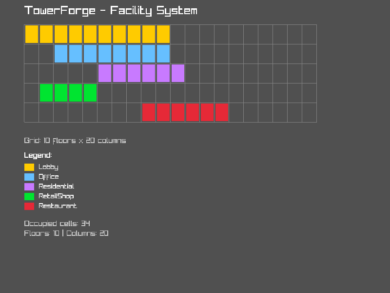
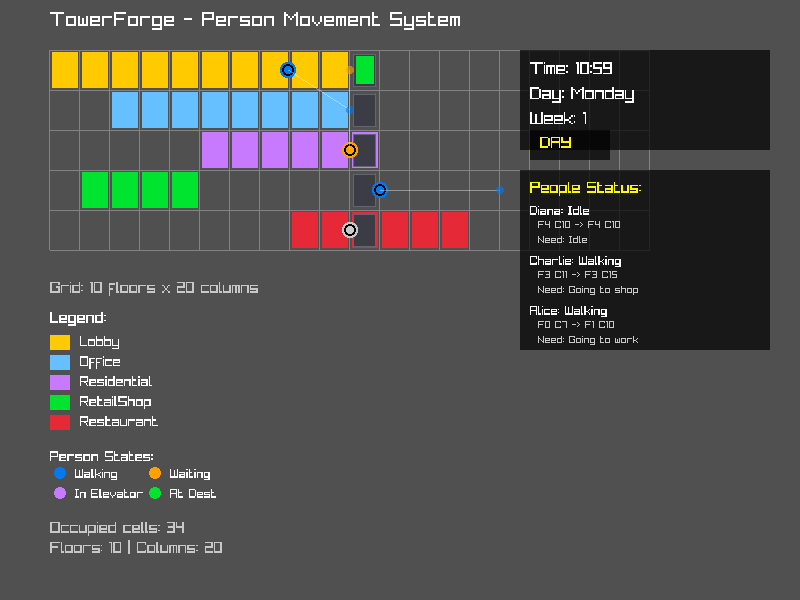
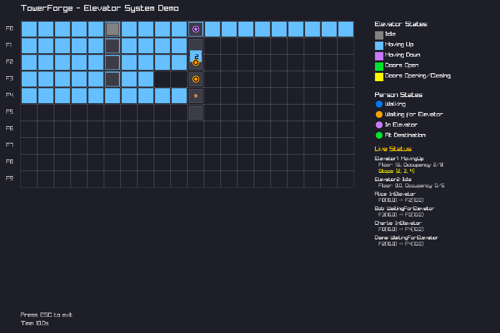
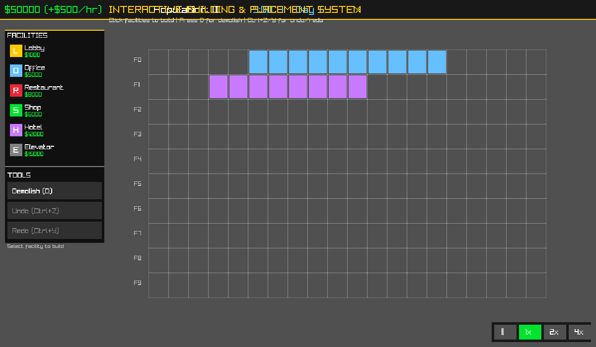
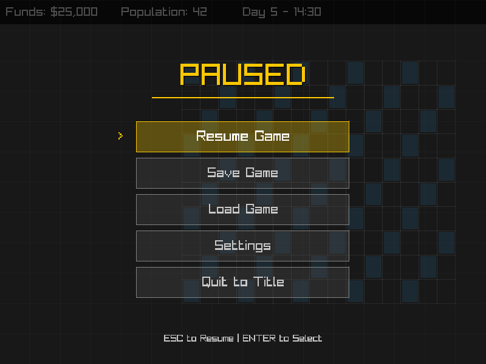
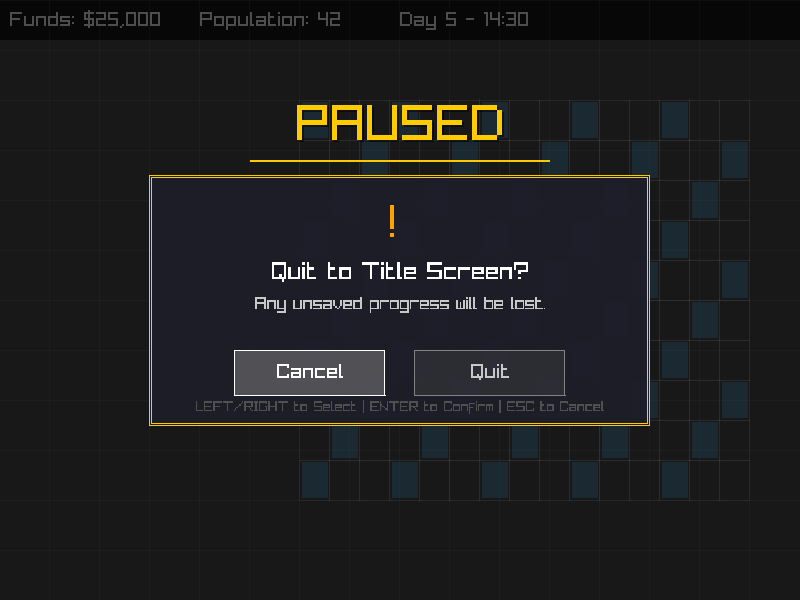
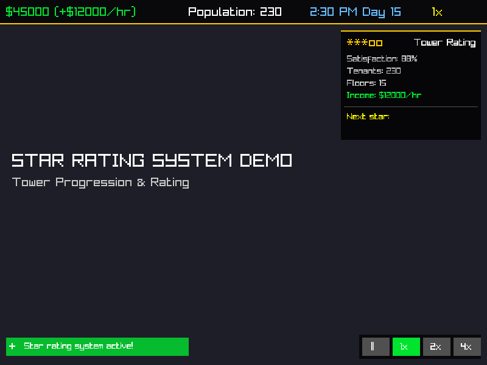

# TowerForge

[/badge.svg)](https://github.com/adam4813/towerforge/actions/workflows/build.yml)

A modern open-source SimTower-inspired skyscraper simulation game built with C++20.

## Tech Stack

- **Language**: C++20
- **ECS**: [flecs](https://github.com/SanderMertens/flecs)
- **Rendering**: [Raylib](https://www.raylib.com/)
- **Build System**: CMake 3.20+
- **Package Manager**: vcpkg

## Building

### Download Pre-Built Binaries

Pre-built binaries for Windows, Linux, and macOS are available from our [GitHub Actions builds](https://github.com/adam4813/towerforge/actions/workflows/build.yml). 

To download the latest build:
1. Go to the [Actions tab](https://github.com/adam4813/towerforge/actions/workflows/build.yml)
2. Click on the most recent successful workflow run
3. Scroll down to the **Artifacts** section
4. Download the archive for your platform:
   - **Windows**: `TowerForge-windows-latest-msvc.zip`
   - **Linux (GCC)**: `TowerForge-ubuntu-latest-gcc.tar.gz`
   - **Linux (Clang)**: `TowerForge-ubuntu-latest-clang.tar.gz`
   - **macOS**: `TowerForge-macos-latest-clang.tar.gz`

**Note:** Artifacts are available for 30 days after each build.

### Prerequisites

- CMake 3.20 or higher
- C++20 compatible compiler (GCC 10+, Clang 10+, MSVC 2019+)
- vcpkg (clone next to this repo or set VCPKG_ROOT)

**Linux Additional Requirements:**
- X11 development libraries: `libx11-dev libxrandr-dev libxinerama-dev libxcursor-dev libxi-dev libgl1-mesa-dev`
  ```bash
  # On Ubuntu/Debian:
  sudo apt-get install libx11-dev libxrandr-dev libxinerama-dev libxcursor-dev libxi-dev libgl1-mesa-dev
  ```

### Build Steps

```bash
# Clone the repository
git clone https://github.com/adam4813/towerforge.git
cd towerforge

# Clone vcpkg if you haven't already
git clone https://github.com/microsoft/vcpkg.git
./vcpkg/bootstrap-vcpkg.sh  # or bootstrap-vcpkg.bat on Windows

# Build the project
mkdir build
cd build
cmake .. -DCMAKE_TOOLCHAIN_FILE=../vcpkg/scripts/buildsystems/vcpkg.cmake
cmake --build .

# Run the application
./bin/towerforge
```

**Note:** The first build will take longer as vcpkg downloads and builds dependencies (Raylib, GLFW3, flecs, etc.).

### Cross-Platform Support

- **Windows**: Visual Studio 2019+ or MinGW-w64
- **Linux**: GCC 10+ or Clang 10+
- **macOS**: Xcode 12+ or Clang 10+

## Architecture

TowerForge is designed with a modular architecture to support future multiplayer features:

- **Core**: Headless simulation library (ECS-based)
  - Built on [flecs ECS](https://github.com/SanderMertens/flecs) for high-performance entity management
  - Modular component-based architecture for easy extension
  - Example components: Actor (people), BuildingComponent (facilities)
  - Example systems: Movement, Actor logging, Building occupancy monitoring
- **Renderer**: 2D vector graphics using Raylib
  - Modular rendering system designed for easy ECS integration
  - Supports GUI, actors, building visuals, and more
  - Hardware-accelerated OpenGL rendering
- **Simulation**: Tower management, tenants, elevators, people AI

### Rendering System

The rendering system is built on [Raylib](https://www.raylib.com/), a simple and easy-to-use library for 2D graphics:

- **Modular Design**: The `Renderer` class in `include/rendering/renderer.h` provides a clean interface
- **ECS Ready**: Designed to integrate seamlessly with the flecs ECS for entity rendering
- **Extensible**: Easy to add new rendering features (sprites, text, particles, etc.)

Current demo renders:
- A blue rectangle (representing a building floor)
- A red circle (representing a person or elevator)

### ECS Structure

The Entity Component System (ECS) is the foundation of TowerForge's simulation. It provides:

**Components** (`include/core/components.hpp`):
- `Position`: 2D position in space
- `Velocity`: Movement velocity
- `Actor`: Represents people in the building (name, destination floor, speed)
- `Person`: Advanced person entity with state machine (Idle, Walking, WaitingForElevator, InElevator, AtDestination)
- `BuildingComponent`: Represents building facilities (offices, restaurants, shops, etc.)
- `TimeManager`: Global singleton for simulation time management (hours, days, weeks, speed control)
- `DailySchedule`: Component for entities with time-based routines (work hours, breaks, etc.)
- `GridPosition`: Grid-based position (floor, column, width)
- `Satisfaction`: Tracks tenant satisfaction levels based on wait times, crowding, noise, and facility quality
- `FacilityEconomics`: Tracks revenue, costs, rent, and occupancy for building facilities
- `TowerEconomy`: Global singleton for tower-wide economy tracking (balance, revenue, expenses)
- `ElevatorShaft`: Vertical shaft containing elevator cars (column, floor range, car count)
- `ElevatorCar`: Individual elevator car with state machine (position, capacity, stop queue)
- `PersonElevatorRequest`: Links person entities to elevators for boarding and riding

**Tower Grid System** (`include/core/tower_grid.hpp`):
- **Dynamic Floor Management**: Start with minimal tower and expand vertically
- **Basement Support**: Add floors below ground level with negative indices
- **Floor Building State**: Track which floor cells are constructed vs. allocated
- **Cost-Based Expansion**: Each floor cell costs $50 to build
- **Automatic Building**: Floors auto-build when placing facilities
- **Manual Expansion**: UI controls to add floors above or basements below
- Facility placement and removal with collision detection
- Spatial query functions for grid operations
- Integrated with ECS for seamless tower management

See [docs/DYNAMIC_FLOOR_SYSTEM.md](docs/DYNAMIC_FLOOR_SYSTEM.md) for detailed documentation on the dynamic floor management system.

**Systems** (`src/core/ecs_world.cpp`):
- **Time Simulation System**: Advances simulation time based on configurable speed multiplier
- **Schedule Execution System**: Triggers scheduled actions for entities at specific times
- **Movement System**: Updates entity positions based on velocity
- **Actor Logging System**: Monitors and logs actor activity
- **Building Occupancy Monitor**: Tracks occupancy of building components
- **Satisfaction Update System**: Updates tenant satisfaction based on crowding, noise, and facility quality
- **Satisfaction Reporting System**: Periodically reports satisfaction levels for tenants
- **Facility Economics System**: Manages tenant counts based on satisfaction levels
- **Daily Economy Processing System**: Processes daily financial transactions
- **Revenue Collection System**: Collects revenue and expenses from all facilities
- **Economic Status Reporting System**: Reports economic status for each facility
- **Person Horizontal Movement System**: Handles walking on same floor
- **Person Waiting System**: Creates elevator requests and manages waiting
- **Person Elevator Riding System**: Fallback for backward compatibility
- **Person State Logging System**: Debug logging for person states
- **Elevator Car Movement System**: Handles elevator movement and state transitions
- **Elevator Call System**: Assigns people to elevator cars
- **Person Elevator Boarding System**: Handles boarding and exiting elevators
- **Elevator Logging System**: Debug logging for elevator states

**ECS World** (`include/core/ecs_world.hpp`):
- Wrapper around flecs world for clean API
- Manages component and system registration
- Provides entity creation and simulation update methods
- Integrated with FacilityManager for high-level facility operations

### Facility System

The Facility System provides a comprehensive framework for creating and managing building facilities in the tower. See [docs/FACILITIES.md](docs/FACILITIES.md) for detailed documentation.

**Core Facility Types**:
- **Office**: Commercial office space (generates rent, holds ~20 workers)
- **Residential**: Condominium units (housing for residents, holds ~4 people per unit)
- **RetailShop**: Retail shops (provides shopping, holds ~15 customers)
- **Lobby**: Main entrance (required on ground floor, holds ~50 people)

**Legacy Types** (for compatibility):
- Restaurant, Hotel, Elevator

**Facility Manager** (`include/core/facility_manager.hpp`):
- High-level API for creating and removing facilities
- Automatic default attributes (width, capacity) for each facility type
- Integration with tower grid for placement validation
- Color management for rendering

**Example Usage**:
```cpp
auto& facility_mgr = ecs_world.GetFacilityManager();

// Create a lobby on ground floor
auto lobby = facility_mgr.CreateFacility(
    BuildingComponent::Type::Lobby, 
    0,     // floor
    0,     // column
    0,     // width (0 = use default)
    "MainLobby"
);

// Create an office on floor 1
auto office = facility_mgr.CreateFacility(
    BuildingComponent::Type::Office,
    1, 2   // floor 1, column 2
);

// Remove a facility
facility_mgr.RemoveFacility(office);
// or by position
facility_mgr.RemoveFacilityAt(1, 2);
```



*Demo showing different facility types with distinct colors*

### Person Movement System

The Person Movement System simulates individuals moving through the tower with a complete state machine. See [docs/PERSON_MOVEMENT_SYSTEM.md](docs/PERSON_MOVEMENT_SYSTEM.md) for detailed documentation.

**Person State Machine**:
- **Idle**: Standing still, no destination
- **Walking**: Moving horizontally on same floor
- **WaitingForElevator**: Waiting for elevator to arrive
- **InElevator**: Currently in an elevator
- **AtDestination**: Reached final destination

**Person Component**:
```cpp
struct Person {
    std::string name;
    PersonState state;
    
    // Current location
    int current_floor;
    float current_column;
    
    // Destination
    int destination_floor;
    float destination_column;
    
    // Movement & needs
    float move_speed;
    float wait_time;
    std::string current_need;
};
```

**Creating People**:
```cpp
// Spawn person in lobby going to office
auto person = ecs_world.CreateEntity("Alice");
Person alice("Alice", 0, 2.0f);  // Floor 0, column 2
alice.SetDestination(5, 10.0f, "Going to work");
person.set<Person>(alice);
person.set<Satisfaction>({80.0f});

// Person will:
// 1. WaitingForElevator (different floor)
// 2. InElevator (elevator arrives)
// 3. Walking (arrived at floor, walking to destination)
// 4. AtDestination (reached column 10)
```

**Movement Features**:
- Smooth horizontal movement (2.0 columns/second default)
- Automatic state transitions based on destination
- Visual representation with color-coded states
- Debug visualization showing state and destination
- Integration ready for elevator system



*Demo showing people in different states with destination indicators*

### Elevator System

The Elevator System provides vertical transportation for person entities in the tower. It features realistic elevator behavior with state machines, passenger queuing, and smart scheduling. See [docs/ELEVATOR.md](docs/ELEVATOR.md) for detailed documentation.

**Core Components:**
- **ElevatorShaft**: Vertical shafts serving multiple floors (configurable floor range)
- **ElevatorCar**: Individual cars with state machines (Idle, MovingUp, MovingDown, DoorsOpen, etc.)
- **PersonElevatorRequest**: Links people to elevators for boarding and riding

**Elevator State Machine:**
```
Idle → MovingUp/MovingDown → DoorsOpening → DoorsOpen → DoorsClosing → Idle
```

**Creating Elevators:**
```cpp
// Create elevator shaft serving floors 0-5 at column 10
auto shaft = ecs_world.CreateEntity("MainElevatorShaft");
shaft.set<ElevatorShaft>({10, 0, 5, 1});  // column, bottom, top, car_count

// Create elevator car
auto car = ecs_world.CreateEntity("Elevator1");
car.set<ElevatorCar>({
    static_cast<int>(shaft.id()),  // shaft reference
    0,   // start at floor 0
    8    // capacity: 8 passengers
});

// People automatically use elevators when changing floors
auto person = ecs_world.CreateEntity("Alice");
Person alice("Alice", 0, 2.0f);  // Floor 0, column 2
alice.SetDestination(5, 10.0f, "Going to work");
person.set<Person>(alice);
// Alice will automatically walk to shaft, board elevator, ride to floor 5, exit
```

**Features:**
- Smooth movement between floors (configurable speed: default 2 floors/second)
- Realistic door operation (opening, open, closing states)
- Passenger capacity limits (default 8 passengers)
- Stop queue management with sorted ordering
- Automatic person boarding and exiting
- Integration with Person Movement System
- Visual state indicators (color-coded by state)



*Demo showing elevator cars in different states, transporting people between floors*

### Using the ECS

```cpp
#include "core/ecs_world.hpp"
#include "core/components.hpp"

// Create and initialize ECS world
TowerForge::Core::ECSWorld world;
world.Initialize();

// Set up global time manager (60x speed)
world.GetWorld().set<TimeManager>({60.0f});

// Create an actor entity with a daily schedule
auto actor = world.CreateEntity("John");
actor.set<Position>({10.0f, 0.0f});
actor.set<Velocity>({0.5f, 0.0f});
actor.set<Actor>({"John", 5, 1.0f});

// Add daily schedule
DailySchedule schedule;
schedule.AddWeekdayAction(ScheduledAction::Type::ArriveWork, 9.0f);   // 9 AM
schedule.AddWeekdayAction(ScheduledAction::Type::LunchBreak, 12.0f);  // 12 PM
schedule.AddWeekdayAction(ScheduledAction::Type::LeaveWork, 17.0f);   // 5 PM
actor.set<DailySchedule>(schedule);

// Create a building component
auto office = world.CreateEntity("Office");
office.set<BuildingComponent>({
    BuildingComponent::Type::Office,
    5,   // floor
    8,   // width
    20   // capacity
});

// Run simulation
float delta_time = 1.0f / 60.0f;
world.Update(delta_time);
```

### Time Simulation System

The time simulation system enables scheduled routines and day/night cycles:

**Features:**
- Configurable simulation speed (pause, normal, fast-forward)
- In-game time tracking (hours, days of week, weeks)
- Daily/weekly schedules for entities
- Automatic triggering of scheduled actions
- Day/night cycle detection
- Business hours tracking

**Time Manager:**
```cpp
// Create time manager with custom speed (e.g., 120 in-game hours per real second)
world.GetWorld().set<TimeManager>({120.0f});

// Access time manager
const auto& time_mgr = world.GetWorld().get<TimeManager>();
std::string current_time = time_mgr.GetTimeString();  // "14:30"
bool is_work_hours = time_mgr.IsBusinessHours();      // 9 AM - 5 PM
bool is_weekend = time_mgr.IsWeekend();                // Saturday/Sunday
```

**Daily Schedules:**
```cpp
DailySchedule schedule;

// Weekday schedule
schedule.AddWeekdayAction(ScheduledAction::Type::ArriveWork, 9.0f);
schedule.AddWeekdayAction(ScheduledAction::Type::LunchBreak, 12.0f);
schedule.AddWeekdayAction(ScheduledAction::Type::LeaveWork, 17.0f);

// Weekend schedule  
schedule.AddWeekendAction(ScheduledAction::Type::Idle, 10.0f);

// Attach to entity
entity.set<DailySchedule>(schedule);
```

### Tenant Satisfaction System

The satisfaction system simulates tenant happiness based on various environmental factors:

**Satisfaction Component:**
```cpp
// Add satisfaction to a tenant
auto tenant = world.CreateEntity("Tenant");
tenant.set<Satisfaction>({75.0f});  // Start with 75% satisfaction

// Get satisfaction level
const auto& sat = tenant.get<Satisfaction>();
std::cout << "Satisfaction: " << sat.satisfaction_score << "% - " 
          << sat.GetLevelString() << std::endl;
```

**Factors Affecting Satisfaction:**
- **Crowding**: High occupancy (>90%) or low occupancy (<30%) reduces satisfaction
- **Noise**: Restaurants and shops generate noise that affects nearby tenants
- **Facility Quality**: Different facility types provide quality bonuses
- **Wait Times**: Elevator delays add penalties (extensible for future features)

**Satisfaction Levels:**
- Very Poor: 0-20%
- Poor: 21-40%
- Average: 41-60%
- Good: 61-80%
- Excellent: 81-100%

### Tower Economy System

The economy system tracks revenue, expenses, and financial performance:

**Tower Economy Singleton:**
```cpp
// Initialize tower economy with starting balance
world.GetWorld().set<TowerEconomy>({10000.0f});  // $10,000 starting balance

// Access tower economy
const auto& economy = world.GetWorld().get<TowerEconomy>();
std::cout << "Balance: $" << economy.total_balance << std::endl;
std::cout << "Daily Revenue: $" << economy.daily_revenue << std::endl;
std::cout << "Daily Expenses: $" << economy.daily_expenses << std::endl;
```

**Facility Economics:**
```cpp
// Add economics to a facility
auto office = world.CreateEntity("Office");
office.set<BuildingComponent>({BuildingComponent::Type::Office, 5, 8, 20});
office.set<FacilityEconomics>({
    150.0f,  // base rent per tenant per day
    30.0f,   // daily operating cost
    20       // max tenants
});

// Economics are influenced by satisfaction
// High satisfaction (>70%) attracts more tenants
// Low satisfaction (<30%) causes tenants to leave
```

**Economic Features:**
- Daily revenue collection based on rent and occupancy
- Operating costs for each facility
- Quality multiplier based on tenant satisfaction (0.5x - 2.0x)
- Automatic tenant count adjustment based on satisfaction
- Daily financial reports with balance tracking

### Star Rating & Tower Progression System

The star rating system evaluates overall tower quality and provides progression milestones:

**Rating Display:**
```
┌──────────────────────┐
│ ***oo Tower Rating  │
│ Satisfaction: 88%    │
│ Tenants: 230         │
│ Floors: 15           │
│ Income: $12,000/hr   │
│ Next star:           │
│   +70 tenants        │
└──────────────────────┘
```

**Star Rating Thresholds:**
- **1 Star**: Starting level
- **2 Stars**: 25+ tenants
- **3 Stars**: 50+ tenants AND 70%+ satisfaction
- **4 Stars**: 100+ tenants AND 75%+ satisfaction AND 20+ floors
- **5 Stars**: 200+ tenants AND 80%+ satisfaction AND 40+ floors AND $10,000+/hr income

**Features:**
- Real-time rating updates based on tower statistics
- Visual star display in HUD (top-right corner)
- Next milestone indicators showing requirements for next star
- End-of-game congratulations summary when 5 stars achieved
- Statistics collected from ECS components (FacilityEconomics, Satisfaction, TowerGrid)

**Implementation:**
```cpp
// Tower rating is calculated automatically each frame
TowerRating& rating = game_state.rating;

// Statistics are collected from ECS world
// - Total tenants from all FacilityEconomics components
// - Average satisfaction from all Satisfaction components
// - Floor count from TowerGrid
// - Hourly income from game state

// Stars are awarded based on thresholds
// Rating display updates in real-time in the HUD
```

### Using the Tower Grid

```cpp
#include "core/ecs_world.hpp"
#include "core/tower_grid.hpp"

// Create and initialize ECS world
TowerForge::Core::ECSWorld world;
world.Initialize();

// Access the tower grid
auto& grid = world.GetTowerGrid();

// Add floors and columns
grid.AddFloors(5);   // Add 5 more floors
grid.AddColumns(10); // Add 10 more columns

// Place a facility on the grid
int facility_id = 1;
bool placed = grid.PlaceFacility(
    3,           // floor
    5,           // column
    8,           // width (in grid cells)
    facility_id  // entity ID
);

// Query the grid
bool occupied = grid.IsOccupied(3, 5);
int id = grid.GetFacilityAt(3, 5);
bool available = grid.IsSpaceAvailable(2, 10, 5);

// Remove a facility
grid.RemoveFacility(facility_id);

### Lua Modding System

TowerForge supports Lua-based modding, allowing players and creators to add custom facilities and visitor types without modifying the core game code. See [docs/MODDING_API.md](docs/MODDING_API.md) for complete API documentation.

**Features**:
- **Custom Facilities**: Define new building facilities with custom properties
- **Custom Visitor Types**: Create new visitor behaviors and preferences
- **Sandboxed Environment**: Lua scripts run in a secure sandbox to prevent unauthorized access
- **Hot-Loading**: Mods are loaded from the `mods/` directory at game start
- **In-Game Management**: Enable/disable mods via the Mods menu (accessible from pause menu)

**Example Mod** (`mods/example_gaming_lounge.lua`):
```lua
ModInfo = {
    id = "gaming_lounge",
    name = "Gaming Lounge Mod",
    version = "1.0.0",
    author = "TowerForge Community",
    description = "Adds a gaming lounge facility"
}

TowerForge.RegisterFacilityType({
    id = "gaming_lounge",
    name = "Gaming Lounge",
    default_width = 10,
    default_capacity = 25,
    required_staff = 3,
    operating_start_hour = 12.0,
    operating_end_hour = 24.0,
    base_rent = 180.0,
    operating_cost = 50.0,
    color = 0xFF8C00FF  -- Orange (RGBA: fully opaque)
})
```

**Available APIs**:
- `TowerForge.RegisterFacilityType(table)` - Register a new facility type
- `TowerForge.RegisterVisitorType(table)` - Register a new visitor type  
- `TowerForge.Log(...)` - Log messages to console for debugging

**Security**:
- File I/O disabled
- System command execution blocked
- No network access
- Safe standard Lua library subset only

```

## Current Status

🚧 **Early Development** - Basic ECS integration complete

### What's Working
- ✅ Flecs ECS integrated and operational
- ✅ Core module with components (Actor, Person, BuildingComponent, Position, Velocity, TimeManager, DailySchedule, Satisfaction, FacilityEconomics, TowerEconomy, ElevatorShaft, ElevatorCar, PersonElevatorRequest)
- ✅ Time simulation system with configurable speed
- ✅ Daily/weekly scheduling system for entities
- ✅ **Person Movement System with State Machine**
  - 5-state machine (Idle, Walking, WaitingForElevator, InElevator, AtDestination)
  - Smooth horizontal movement on floors
  - Vertical movement with actual elevator integration
  - Visual representation with color-coded states
  - Debug visualization with destination indicators
- ✅ **Elevator System**
  - Elevator shafts with configurable floor ranges
  - Elevator cars with 6-state machine (Idle, MovingUp, MovingDown, DoorsOpening, DoorsOpen, DoorsClosing)
  - Smooth movement between floors (2 floors/second)
  - Realistic door operation with timing
  - Passenger capacity management (default 8 passengers)
  - Stop queue with sorted ordering
  - Automatic person boarding and exiting
  - Integration with Person Movement System
  - Visual state indicators
- ✅ Tenant satisfaction system with dynamic updates based on crowding, noise, and quality
- ✅ Tower economy system with revenue collection, operating costs, and balance tracking
- ✅ Satisfaction-driven tenant behavior (tenants join/leave based on satisfaction)
- ✅ Quality multipliers for rent based on satisfaction levels
- ✅ Example systems (Time simulation, Schedule execution, Movement, Actor logging, Building occupancy, Satisfaction, Economics, Person movement, Elevator systems)
- ✅ Demo application showing ECS in action
- ✅ Basic project structure
- ✅ Raylib integration with 2D vector rendering
- ✅ Modular renderer design for ECS integration
- ✅ Working demo window with test shapes
- ✅ UI display of current simulation time and day/night cycle
- ✅ UI display of satisfaction levels with color-coded indicators
- ✅ UI display of tower economics (balance, revenue, expenses)
- ✅ Comprehensive unit tests for Tower Grid System
- ✅ **HUD and Information Display System**
  - Top bar with funds, population, time, and speed display
  - Info panels for facilities, people, and elevators
  - Notification system with auto-expiry
  - Build menu for selecting facilities
  - Speed controls UI (pause, 1x, 2x, 4x)
  - **Star rating overlay with real-time updates**
  - **Contextual tooltip system with hover and keyboard support**
- ✅ **Contextual Tooltip System**
  - Hover tooltips with 0.5s delay for all UI elements
  - Dynamic content based on game state (funds, locked items, staffing needs)
  - Smart positioning (stays on screen, adjusts to avoid edges)
  - Keyboard navigation support for accessibility
  - Integration across BuildMenu, HUD, PlacementSystem
  - Word-wrapped text for readability
  - Shows keyboard shortcuts and contextual help
- ✅ **Star Rating & Tower Progression System**
  - Real-time tower quality evaluation
  - 5-star rating system based on satisfaction, tenants, floors, and income
  - Visual star display in HUD with current statistics
  - Next milestone indicators showing requirements
  - End-of-game congratulations summary at 5 stars
  - Automatic statistics collection from ECS components
- ✅ **Interactive Building and Placement System**
  - Mouse-driven facility placement with preview
  - Green/red validation feedback for placement
  - Construction progress with visual indicators
  - Demolish mode with 50% cost recovery
  - Undo/redo stack (up to 20 actions)
  - Keyboard shortcuts (D, Ctrl+Z, Ctrl+Y)
  - Economy integration with costs and refunds
- ✅ **In-Game Pause Menu**
  - ESC key to toggle pause overlay
  - Simulation pauses when menu is open
  - Menu options: Resume, Save, Load, Settings, Quit to Title
  - Confirmation dialog for quitting with unsaved changes
  - Keyboard and mouse navigation
  - Professional UI with animations
- ✅ **Research and Upgrade Tree System**
  - R key to toggle research tree menu
  - 9 default research nodes across 3 progression tiers
  - Visual state indicators (locked 🔒, upgradable ✨, unlocked ✅)
  - Node types: Facility Unlocks, Elevator Speed/Capacity, Income/Satisfaction Bonuses, Construction Speed, Cost Reduction
  - Automatic research points awards based on milestones (tenants, income)
  - Interactive grid-based UI with hover details
  - Full save/load persistence
  - Global bonus tracking (multipliers and bonuses)

### Tower Grid System Demo


The screenshot above shows the Tower Grid System in action with:
- A 10 floors × 20 columns grid
- 5 different facilities placed (Lobby, Office, Restaurant, Shop, Hotel)
- Visual representation of occupied cells with color coding
- Real-time grid statistics (38 occupied cells shown)

### Interactive Placement System Demo



The interactive building and placement system provides a complete mouse-driven interface for building your tower:
- **Build Menu**: Left sidebar with facility types, costs, and tool buttons
- **Placement Preview**: Green/red highlights show valid/invalid placements
- **Construction Progress**: Orange overlays with progress bars show ongoing construction
- **Demolish Mode**: Red highlights for facilities that can be demolished
- **Advanced Undo/Redo**: Command Pattern implementation with full state restoration
- **History Panel**: Visual timeline of actions with timestamps (toggle with H key)
- **Multi-Action Undo/Redo**: Click any history entry to undo/redo multiple actions
- **Funds Validation**: Prevents undo/redo when insufficient funds
- **Keyboard Shortcuts**: D for demolish, H for history, Ctrl+Z/Y for undo/redo

**New in Latest Update:**
- Complete rewrite using Command Pattern for robust undo/redo
- Demolish operations now properly restore facilities with all properties
- Visual history panel shows up to 50 recent actions with cost changes
- Interactive timeline - click any action to jump to that point in history
- Full funds validation ensures operations only succeed when affordable

See [docs/PLACEMENT_SYSTEM.md](docs/PLACEMENT_SYSTEM.md) and [docs/COMMAND_PATTERN_HISTORY.md](docs/COMMAND_PATTERN_HISTORY.md) for complete documentation.

### In-Game Pause Menu



The pause menu provides full game control during gameplay:
- **ESC Key**: Toggles pause menu overlay
- **Pause Simulation**: Game freezes while menu is open
- **Menu Options**: Resume, Save, Load, Settings, Quit to Title
- **Quit Confirmation**: Prevents accidental exits with warning dialog



See [docs/PAUSE_MENU_IMPLEMENTATION.md](docs/PAUSE_MENU_IMPLEMENTATION.md) for complete documentation.

### Star Rating System Demo



The star rating system provides progression feedback and goals:
- **Star Display**: Top-right corner shows current rating (1-5 stars)
- **Tower Statistics**: Real-time display of satisfaction, tenants, floors, and income
- **Next Milestone**: Clear indicators showing requirements for the next star
- **End-Game Summary**: Congratulations overlay when reaching 5 stars
- **Dynamic Updates**: Rating recalculates each frame based on tower performance

The system encourages players to balance tenant satisfaction, growth, and profitability to achieve the maximum 5-star rating.

### Running the Demo

After building, run the main application to see the simulation with HUD:

```bash
cd build
./bin/towerforge
```

The application demonstrates:
- Actors moving with velocity
- Tenant satisfaction levels changing based on facility conditions
- Economic simulation with revenue collection and expense tracking
- Interactive building and placement with the mouse
- Real-time construction progress
- **Advanced undo/redo with Command Pattern and visual history panel**
- **Star rating system with progression tracking**
- **Interactive HUD with real-time game information**
  - Top bar with funds, population, time, and simulation speed
  - Star rating overlay with tower statistics and next milestone
  - History panel with action timeline (press H to toggle)
  - Info panels for facilities, people, and elevators
  - Notification system
  - Build menu with facility types and costs
  - Speed controls
  - UI display of current time

For detailed documentation on the HUD system, see [docs/HUD_SYSTEM.md](docs/deprecated_archive/HUD_SYSTEM.md).

For detailed documentation on the tooltip system, see [docs/TOOLTIP_SYSTEM.md](docs/TOOLTIP_SYSTEM.md).

See [Issues](https://github.com/adam4813/towerforge/issues) for the development roadmap.

## License

TBD
