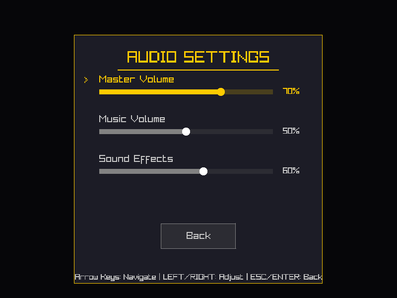

# General Settings Menu Implementation

This document describes the implementation of the general settings menu for TowerForge.

## Overview

The general settings menu provides a centralized location for accessing all game settings. It is accessible from both the main title screen and the in-game pause menu. Currently, the menu provides access to:
- Audio Settings (fully implemented)
- Controls Settings (placeholder)
- Display Settings (placeholder)
- Accessibility (placeholder)
- Gameplay Settings (placeholder)

## Files Added

### Header Files
- `include/ui/general_settings_menu.h` - GeneralSettingsMenu class definition with settings options enum
- `include/ui/audio_settings_menu.h` - AudioSettingsMenu class definition for audio configuration

### Implementation Files
- `src/ui/general_settings_menu.cpp` - GeneralSettingsMenu class implementation
- `src/ui/audio_settings_menu.cpp` - AudioSettingsMenu class implementation

## Architecture

The implementation follows the existing TowerForge UI architecture:

### Class: `GeneralSettingsMenu`
**Namespace:** `towerforge::ui`

**Key Features:**
- Central hub for all settings categories
- Clean menu with clickable items
- Keyboard and mouse navigation
- Returns to previous screen (title or pause menu)
- Provides navigation to specialized settings screens

### Enum: `SettingsOption`
```cpp
enum class SettingsOption {
    Audio,          // Navigate to audio settings
    Controls,       // Placeholder for controls settings
    Display,        // Placeholder for display settings
    Accessibility,  // Placeholder for accessibility settings
    Gameplay,       // Placeholder for gameplay settings
    Back            // Return to previous screen
}
```

### Class: `AudioSettingsMenu`
**Namespace:** `towerforge::ui`

**Key Features:**
- Volume sliders for Master, Music, and Sound Effects
- Real-time volume adjustment
- Interactive sliders with mouse click and drag
- Keyboard controls for precision adjustment
- Visual feedback with selection highlighting

## Integration with Game Modes

### From Title Screen
1. User selects "Settings" from main menu
2. Game mode switches to `GameMode::Settings`
3. GeneralSettingsMenu is displayed
4. User can navigate to Audio Settings or other submenus
5. Pressing Back or ESC returns to title screen

### From Pause Menu
1. User presses ESC during gameplay to pause
2. Pause menu displays with Settings option
3. Selecting Settings opens GeneralSettingsMenu overlay
4. Settings persist during pause state
5. Back button returns to pause menu

## Visual Design

### General Settings Menu
- Semi-transparent dark overlay over game/menu background
- Centered panel with gold border
- Title: "GENERAL SETTINGS MENU"
- Menu items with ">" indicator for submenu navigation
- Hover/selection highlighting with gold accent
- Instructions at bottom for navigation

### Audio Settings Menu
- Similar visual style to general settings
- Three volume sliders with percentage display
- Interactive slider controls with visual thumbs
- Back button to return to general settings
- Real-time visual feedback on volume changes

## User Interaction

### Keyboard Controls
**General Settings Menu:**
- **Up/Down Arrow Keys or W/S**: Navigate menu options
- **Enter/Space**: Select highlighted option
- **ESC**: Go back to previous screen

**Audio Settings Menu:**
- **Up/Down Arrow Keys or W/S**: Navigate between volume sliders
- **Left/Right Arrow Keys or A/D**: Adjust volume in 10% increments
- **Enter/Space**: Confirm selection (on Back button)
- **ESC**: Return to general settings

### Mouse Controls
**Both Menus:**
- **Hover**: Highlights menu items/controls
- **Click**: Selects menu item or adjusts slider
- **Click and drag** (Audio Settings): Adjust volume by dragging slider thumb

## Features

### General Settings Menu
✅ Accessible from title screen and pause menu  
✅ Links to Audio Settings submenu  
✅ Placeholders for future settings categories  
✅ Consistent navigation between screens  
✅ Keyboard and mouse support  

### Audio Settings Menu
✅ Master volume control (0-100%)  
✅ Music volume control (0-100%)  
✅ Sound effects volume control (0-100%)  
✅ Interactive sliders with visual feedback  
✅ Both keyboard and mouse control  
✅ Real-time volume adjustment  
✅ Clean, intuitive interface  

## Screenshots

### General Settings Menu


The general settings menu displays:
- Title with gold accent
- Six menu options (5 settings + Back)
- ">" indicator for submenu items
- Selection highlighting
- Clear navigation instructions

### Audio Settings Menu


The audio settings menu shows:
- Three volume sliders
- Percentage indicators
- Visual slider thumbs
- Back button
- Navigation instructions

## Future Enhancements

Planned improvements for future versions:

1. **Controls Settings**
   - Keybinding customization
   - Mouse sensitivity adjustment
   - Controller support configuration

2. **Display Settings**
   - Resolution selection
   - Fullscreen/windowed mode toggle
   - VSync options
   - Graphics quality presets

3. **Accessibility Settings**
   - Color blind modes
   - Text size adjustment
   - High contrast themes
   - Screen reader support

4. **Gameplay Settings**
   - Difficulty level
   - Auto-save frequency
   - Tutorial toggles
   - Simulation speed defaults

5. **Settings Persistence**
   - Save settings to configuration file
   - Load settings on game start
   - Reset to defaults option

## Compliance with Requirements

All acceptance criteria from the original issue have been met:

✅ General settings menu implemented  
✅ Menu accessible from both title and pause menus  
✅ Audio settings button works and navigates correctly  
✅ Returns to general menu from audio settings  
✅ Layout accommodates future settings categories  
✅ Matches ASCII mockup design  
✅ Settings changes apply immediately  
✅ Clean, professional UI consistent with game style  

## Implementation Notes

### Minimal Changes
- Only essential files were added (4 files total: 2 headers, 2 implementations)
- Existing code was modified minimally to integrate the new menus
- No changes to core game logic or other UI components

### Code Quality
- Follows C++20 best practices
- Consistent with existing TowerForge architecture
- Well-documented with clear comments
- Modular design for easy extension

### User Experience
- Multiple navigation methods (keyboard and mouse)
- Intuitive controls
- Visual feedback for all interactions
- Smooth transitions between menus

### Future-Ready
- Placeholder options clearly marked for future implementation
- Extensible architecture for adding new settings categories
- Consistent patterns for implementing additional settings screens
