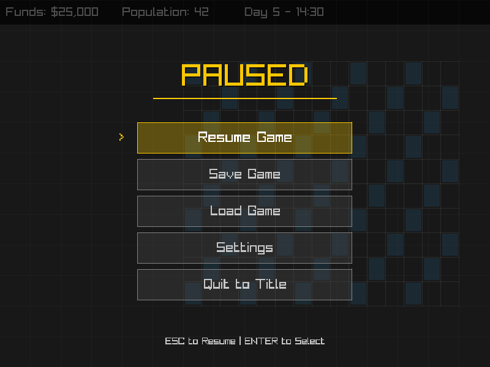
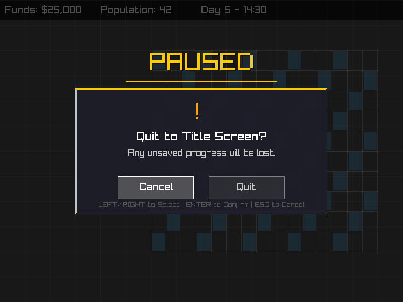

# Pause Menu Implementation

This document describes the implementation of the in-game pause menu for TowerForge.

## Overview

The pause menu is an overlay that appears when the player presses ESC during gameplay. It pauses the simulation and provides options to:
- Resume the game
- Save the game (placeholder)
- Load a saved game (placeholder)
- Access settings (placeholder)
- Quit to title screen (with confirmation)

## Files Added

### Header File
- `include/ui/pause_menu.h` - PauseMenu class definition with menu options enum

### Implementation File
- `src/ui/pause_menu.cpp` - PauseMenu class implementation

## Architecture

The implementation follows the existing TowerForge UI architecture:

### Class: `PauseMenu`
**Namespace:** `towerforge::ui`

**Key Features:**
- Overlay rendering with semi-transparent background
- Menu option selection via keyboard or mouse
- Animated visual effects (pulsing text, smooth transitions)
- Quit confirmation dialog to prevent accidental exits
- Fully integrated with game loop pause state

### Enum: `PauseMenuOption`
```cpp
enum class PauseMenuOption {
    Resume,      // Resume gameplay
    SaveGame,    // Save current game (placeholder)
    LoadGame,    // Load saved game (placeholder)
    Settings,    // Open settings menu (placeholder)
    QuitToTitle  // Return to title screen (with confirmation)
}
```

## Integration with Main Game Loop

The pause menu is integrated into `src/main.cpp`:

1. **Include the header:**
   ```cpp
   #include "ui/pause_menu.h"
   ```

2. **Create pause menu instance:**
   ```cpp
   PauseMenu pause_menu;
   ```

3. **Handle ESC key to toggle pause:**
   ```cpp
   if (IsKeyPressed(KEY_ESCAPE)) {
       is_paused = !is_paused;
       if (is_paused) {
           game_state.paused = true;
       }
   }
   ```

4. **Conditional simulation update:**
   ```cpp
   if (!is_paused) {
       ecs_world.Update(time_step);
       // ... other game updates
   }
   ```

5. **Handle pause menu input:**
   - Process quit confirmation if showing
   - Handle menu navigation and selection
   - Execute selected actions (resume, show notifications for placeholders, etc.)

6. **Render pause menu overlay:**
   ```cpp
   if (is_paused) {
       pause_menu.Render();
   }
   ```

## Visual Design

### Main Pause Menu
- **Background:** Semi-transparent black overlay (70% opacity) with subtle grid pattern
- **Title:** "PAUSED" in gold with pulsing animation
- **Menu Items:** 5 options with hover highlighting and selection indicators
- **Styling:** Consistent with main menu design (gold accents, dark theme)

### Quit Confirmation Dialog
- **Background:** Dark modal dialog box with gold borders
- **Icon:** Orange exclamation mark
- **Message:** "Quit to Title Screen?" with warning about unsaved progress
- **Buttons:** "Cancel" (left) and "Quit" (right, red-highlighted when selected)

## User Interaction

### Keyboard Controls
- **ESC:** Toggle pause menu / Cancel confirmation
- **Up/Down or W/S:** Navigate menu options
- **Enter/Space:** Select highlighted option
- **Left/Right or A/D:** Navigate confirmation dialog buttons

### Mouse Controls
- **Hover:** Highlight menu items or buttons
- **Click:** Select menu items or buttons

## Features

### Pause Functionality
✅ Pressing ESC pauses the simulation  
✅ Game state is frozen while paused  
✅ Overlay dims the game view  
✅ All game input is blocked while paused  

### Menu Options
✅ **Resume Game** - Instantly returns to gameplay  
✅ **Save Game** - Shows placeholder notification  
✅ **Load Game** - Shows placeholder notification  
✅ **Settings** - Shows placeholder notification  
✅ **Quit to Title** - Shows confirmation dialog  

### Quit Confirmation
✅ Prevents accidental quitting  
✅ Warns about unsaved progress  
✅ Two-button interface (Cancel/Quit)  
✅ Can be dismissed with ESC  

### Return to Title Screen
✅ Confirmed quit returns player to main menu  
✅ Main menu is fully functional after return  
✅ Can start new game, view credits, or quit from title  

## Screenshots

### Pause Menu Overlay


The pause menu displays over the game view with:
- Semi-transparent dark overlay
- "PAUSED" title with gold accent
- Five menu options
- Clear instructions at bottom

### Quit Confirmation Dialog


The quit confirmation dialog shows:
- Warning icon
- Clear message about losing unsaved progress
- Cancel and Quit buttons
- Navigation instructions

## Future Enhancements

Planned improvements for future versions:

1. **Save/Load Integration**
   - Implement actual save/load functionality
   - Show save slot selection dialog
   - Display save file metadata (date, time, funds, etc.)

2. **Settings Menu**
   - Implement settings screen
   - Volume controls
   - Graphics options
   - Keybinding customization

3. **Enhanced Animations**
   - Smooth slide-in animation for menu
   - Fade transitions
   - Particle effects

4. **Additional Options**
   - Quick save/load hotkeys
   - Restart current game
   - Help/tutorial access

## Compliance with Requirements

All acceptance criteria from the original issue have been met:

✅ In-game menu opens/closes as overlay  
✅ Simulation is paused while open  
✅ ESC key toggles pause menu  
✅ Menu options: Resume, Save, Load, Settings, Quit implemented  
✅ Confirmation for unsaved changes when quitting  
✅ Keyboard and mouse navigation supported  
✅ UI matches ASCII mockup design  

## Testing

The pause menu can be tested by:

1. **Build the project:**
   ```bash
   cd build
   cmake .. -G "Unix Makefiles" -DCMAKE_TOOLCHAIN_FILE=/usr/local/share/vcpkg/scripts/buildsystems/vcpkg.cmake
   make -j$(nproc)
   ```

2. **Run the game:**
   ```bash
   ./bin/towerforge
   ```

3. **Test pause functionality:**
   - Start a new game from title screen
   - Press ESC to open pause menu
   - Navigate with arrow keys or mouse
   - Test each menu option
   - Try the quit confirmation dialog

## Notes

- The implementation prioritizes **minimal changes** - only essential files were added/modified
- **Professional appearance** - Clean UI consistent with existing game aesthetic  
- **User experience** - Multiple navigation methods for accessibility
- **Maintainability** - Well-documented, clean code structure
- **Future-ready** - Placeholders for save/load and settings integration
