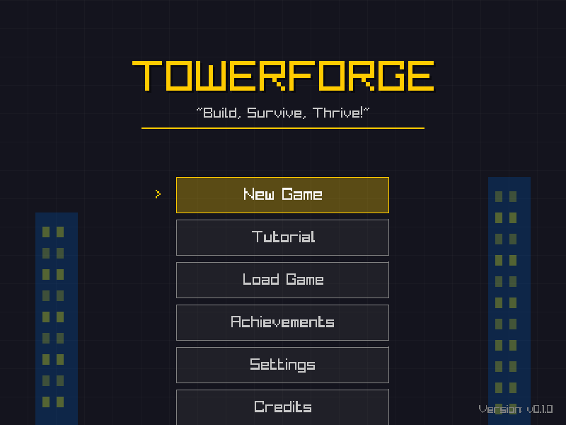

# Tutorial/Onboarding Mode Implementation

## Overview

The tutorial system provides an interactive step-by-step guide for new players to learn the basic mechanics of TowerForge. The tutorial is accessible from the main menu and guides players through building their first facilities.

## Features

### Main Menu Integration

- **Tutorial Option**: Added between "New Game" and "Load Game" in the main menu
- **Keyboard Shortcut**: Press `T` to quick-select Tutorial
- **Mouse Support**: Click to select Tutorial option

### Tutorial Flow

The tutorial guides players through these steps:

1. **Build a Lobby** - Learn to select and place the first facility
2. **Add a Business (Office)** - Place an office above the lobby
3. **Add a Shop** - Place a retail shop on another floor
4. **Stairs (Coming Soon)** - Placeholder for stair connections
5. **Condos (Coming Soon)** - Placeholder for residential units
6. **Connect with Elevator** - Add elevator for vertical transportation

### Tutorial UI

- **Overlay Display**: Shows at the top of the screen during tutorial
- **Step Information**: Clear title and hint for each step
- **Progress Bar**: Visual indicator showing X/6 steps completed
- **Skip Button**: Allows experienced players to exit tutorial at any time
- **Pulsing Effects**: Animated elements to draw attention
- **Gold Borders**: Highlights required facility in build menu

### Build Menu Integration

During tutorial mode:
- **Facility Highlighting**: Required facility has gold border
- **Facility Dimming**: Non-required facilities are greyed out
- **Click Restriction**: Only highlighted facility can be selected
- **Visual Feedback**: Clear indication of what to build next

### Starter Tower System

After tutorial completion or skip, players start with a pre-built tower:
- Lobby (Floor 0)
- Office (Floor 1)
- Retail Shop (Floor 1)
- Residential (Floor 2)
- Elevator (connecting floors)

**New Game** option also uses this starter tower setup.

## Architecture

### Files Added

- `include/ui/tutorial_manager.h` - Tutorial manager class header
- `src/ui/tutorial_manager.cpp` - Tutorial manager implementation
- `src/menu_screenshot.cpp` - Screenshot tool for menu documentation

### Files Modified

- `include/core/game.h` - Added Tutorial game state
- `src/core/game.cpp` - Tutorial state management and integration
- `include/ui/main_menu.h` - Added Tutorial menu option
- `src/ui/main_menu.cpp` - Tutorial menu item
- `include/ui/build_menu.h` - Tutorial mode support
- `src/ui/build_menu.cpp` - Facility highlighting and restrictions
- `CMakeLists.txt` - Added tutorial_manager.cpp to build

### Class: TutorialManager

**Purpose**: Manages tutorial state, steps, and UI

**Key Methods**:
- `Initialize()` - Reset tutorial to first step
- `Update(delta_time)` - Update animations
- `Render()` - Draw tutorial overlay
- `HandleInput()` - Check for skip/exit
- `OnFacilityPlaced(facility_type)` - Notify when player places facility
- `GetHighlightedFacility()` - Get facility name to highlight
- `IsFacilityAllowed(facility_type)` - Check if facility can be placed

**Tutorial Steps Enum**:
```cpp
enum class TutorialStep {
    BuildLobby = 0,
    BuildBusiness,
    BuildShop,
    BuildStair,
    BuildCondo,
    BuildElevator,
    Complete
};
```

### Integration Points

#### Game State Flow
```
TitleScreen -> Tutorial (new) -> InGame
                    ↓
               (skip/complete)
                    ↓
                CreateStarterTower() -> InGame
```

#### Facility Placement Notification
When a facility is placed in tutorial mode:
```cpp
// In game.cpp after successful placement
if (tutorial_active_ && tutorial_manager_) {
    tutorial_manager_->OnFacilityPlaced(facility_name);
}
```

#### Build Menu Tutorial Mode
```cpp
// Set tutorial mode with highlighted facility
build_menu_->SetTutorialMode(true, "Lobby");

// Disable tutorial mode
build_menu_->SetTutorialMode(false);
```

## User Experience

### Starting Tutorial
1. Launch TowerForge
2. Main menu appears with "Tutorial" option
3. Select Tutorial with mouse or press `T`
4. Tutorial mode initializes with empty tower
5. Overlay appears with first step instructions

### During Tutorial
- **Step-by-step guidance** with clear instructions
- **Visual highlighting** shows which facility to build
- **Restricted actions** - can only build required facility
- **Progress tracking** - see current step out of total
- **Skip anytime** - press ESC or click Skip button

### Completing Tutorial
- Tutorial automatically advances when correct facility is placed
- Placeholder steps (stairs, condos) advance with SPACE key
- Upon completion, transition to normal game mode
- Tutorial facilities remain in place
- All build options become available

### Skipping Tutorial
- Click "Skip Tutorial" button or press ESC
- Starter tower is created automatically
- Transitions directly to normal game mode

## Future Enhancements

Potential improvements for future versions:

1. **Additional Facility Types**
   - Add stairs as separate facility type
   - Include residential/condo buildings in build menu
   - Restaurant and hotel tutorials

2. **Advanced Tutorials**
   - Financial management tutorial
   - Tenant satisfaction tutorial
   - Transportation optimization tutorial
   - Research tree tutorial

3. **Tutorial Completion Tracking**
   - Save tutorial completion status
   - Unlock achievements for completing tutorial
   - Option to replay tutorial from settings

4. **Enhanced UI**
   - Animated arrows pointing to UI elements
   - Character/mascot guide
   - Voice-over or sound effects
   - Interactive hints on hover

5. **Contextual Help**
   - In-game help tooltips
   - Quick tips system
   - Help menu with tutorial replay option

## Testing

### Manual Testing Checklist

- [x] Tutorial option appears in main menu
- [x] Tutorial launches with overlay
- [x] Build menu highlights required facility
- [x] Non-required facilities are greyed out
- [x] Placing correct facility advances tutorial
- [x] Progress bar updates correctly
- [x] Skip button exits tutorial
- [x] ESC key exits tutorial
- [x] Starter tower created on completion
- [x] Starter tower created on skip
- [x] New Game creates starter tower
- [x] Tutorial transitions to normal game mode

### Known Limitations

1. **Facility Types**: Current implementation uses available facilities (Lobby, Office, Shop, Elevator). Stairs and Condos are placeholders since they're not yet in the build menu.

2. **Tutorial State**: Tutorial completion is not persisted. Each game session shows the tutorial option.

3. **Starter Tower**: The starter tower uses a simple placement pattern. Future versions could use a more sophisticated layout.

## Code Examples

### Checking Tutorial Mode in Custom Code

```cpp
// In a custom game system
if (tutorial_active_) {
    // Tutorial-specific behavior
    std::string required = tutorial_manager_->GetHighlightedFacility();
    if (!required.empty()) {
        // Show hints or restrict actions
    }
}
```

### Adding Tutorial Steps

To add a new tutorial step:

1. Add to `TutorialStep` enum in `tutorial_manager.h`
2. Update `GetStepTitle()` to return step title
3. Update `GetStepHint()` to return step hint
4. Update `GetRequiredFacility()` to return facility name
5. Update `OnFacilityPlaced()` to handle step completion
6. Update progress calculation if needed

## Screenshots

### Main Menu with Tutorial Option


The Tutorial option is positioned between "New Game" and "Load Game", maintaining the logical flow of menu options.

---

**Implementation Date**: October 2024  
**Version**: 0.1.0  
**Contributors**: Copilot AI, adam4813
